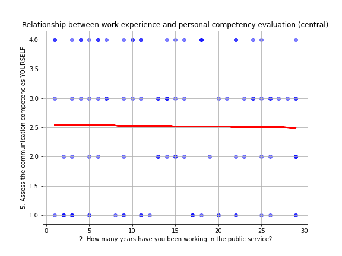

# Analysis of the communication competencies of public servants in Kazakhstan

This analysis is based on the results of a survey that was conducted by a doctoral student at the Academy of Public Administration under the President of the Republic of Kazakhstan among public servants of central government bodies (sampling 446 public servants) and local executive bodies (sampling 1332 public servants), in order to identify key aspects of communication between government bodies with the population and the level of communicative competence of civ public servants.
Surveying public servants is one of the research methods used in social sciences and public service research to collect useful data for analyzing and understanding various aspects of public administration. Survey research on government officials can help identify key trends, challenges, and opportunities in public administration.
The survey questions were the same for public servants in central government and local executive bodies. This was done to compare the results across different levels of government agencies.
The project's main goal is to show how survey results can be processed and analyzed to determine the level of communication competencies of public servants in Kazakhstan, to gain an understanding of the definition and importance of communication competencies, to identify important means of communication with the population, and to determine how government agencies approach communications. This project's goal is not to study the process of organizing a survey. To draw more accurate conclusions, consider the study's context, the number of respondents, and the data collection methodology. At the same time, some findings are critical for analysis.

## Input Data

For the analysis, two main Excel files containing survey results were used.
The **ЦГО рус.xlsx** includes the results of a survey of public servants from central government bodies.
The **МИО рус.xlsx** contains the results of a survey conducted among public servants from local executive bodies.
The surveys were conducted in Russian and then translated into English for easier analysis and comprehension.

## Deliverables and Instructions

The project includes three scripts **surveycental.py**, **surveylocal.py**, and **general.py**, one merged file **merged_file.xlsx**, **18 png** files.

## Script 1: surveycental.py

This script is an exploratory analysis of data on the assessment and improvement of communication competencies among public servants in central government agencies. 
1.	The script begins by asking respondents for general and demographic information such as their workplace, gender, age, and average work experience. This information is useful for analyzing and interpreting survey results.
2.	The script analyzes the correlation between work experience and self-assessment of communication competencies, creating a graph (corr_exper_asses_central.png)  to demonstrate this.
3.	The script will assess understanding of professional communication. When developing communication strategies and deciding how to communicate with the public, public servants must correctly define and interpret communicative competencies.
4.	In the following section, public servants from central government bodies assess communication competencies at various levels (general, self-assessment, colleagues, and principal). The comparative result is shown in graph comm_level_central.png.
5.	The script then defines the communication approach of central government agencies and shows the results in the approaches_central.png diagram.
6.	Then examines the Pearson correlations and produces a p-value between the general score and the other communication competencies levels. The results are stored in the files corr_gen_self_central.png, corr_gen_principal_central.png, and corr_gen_colleagues_central.png.
7.	The figure methods_for_improving_central.png displays the results of the survey on how public servants can improve their communicative competencies.
8.	The script evaluates the effectiveness of various communication methods, including in person meetings, telecommunications, email correspondence, and textual responses to requests. The results are shown in the communication_means_central.png diagram.

## Script 2: surveylocal.py

The second script performs the same actions as the first script. As previously stated, the questions for the two categories were identical, allowing for comparisons of results across levels of government. Thereby:
1.	The script begins by gathering general demographic information from respondents, including their workplace, gender, age, and average work experience.
2.	The script evaluates the correlation between work experience and self-assessment of communication competencies, creating a graph (corr_exper_asses_local.png) to demonstrate this.
3.	The script will assess local government officials' understanding of professional communication.
4.	In the following section, public servants from local executive bodies assess communication competencies at various levels (general, self-assessment, colleagues, and principal). The comparative result is shown in figure comm_level_local.png.
5.	The script determines the communication approach for local executive bodies and displays the results in the approaches_local.png diagram.
6.	Then examines the Pearson correlations and produces a p-value between the general score and the other communication competencies levels. The results are stored in the files corr_gen_self_local.png, corr_gen_principal_local.png, and corr_gen_colleagues_local.png.
7.	The figure methods_for_improving_local.png displays the results of a survey on how public servants can improve their communication competencies.
8.	The script evaluates the effectiveness of various communication methods, including in person meetings, telecommunications, email correspondence, and textual responses to requests. The results are shown in the communication_means_local.png diagram.

## Script 3: general.py

This script aims to identify and analyze common key trends in the communication competencies of public servants in Kazakhstan. 
1. The script reads survey results from two previous files, merges them into a single DataFrame, and saves it as merged_file.xlsx.
2. The script analyzes the sample's general characteristics, including participant count, gender distribution, and age range.
3. The script creates a bar chart (time_to_communication.png) to visualize the amount of time government employees spend communicating.
4. The script analyzes feedback to ensure accurate interpretation. To accomplish this, it creates a pie chart, feedback.png, which shows the percentage of various types of responses to the corresponding question.

## Analysis/discuss the results

In public administration, there is a growing recognition of the need to foster effective communication, form partnerships for the formation and implementation of public policy with public society, business entities, and citizens, and improve the efficiency of public policy outcomes and public service delivery.
In 2021, the Concept for the Development of Public Administration until 2030 announced that Kazakhstan's public administration model is based on the "listening" state principle. Following this, government bodies at all levels began to actively reform communication mechanisms. They announced the development of barrier-free infrastructure and the shift to a service model.  
However, the causes and consequences of the "Tragic January" of 2022, which resulted in the deaths of 227 Kazakhstanis, negated the main results of the work done to involve citizens in public administration through information and communication technologies. The failure to provide timely explanations to the public about the reasons for the increase in liquefied gas prices sparked protests and riots, jeopardizing the country's security.
This case clearly demonstrates the importance of communication support for government agencies' activities and management decisions. Public servants' communication competencies are particularly important.
Furthermore, Kazakhstan's current national emergencies and unexpected regional crises may result in the emergence of new and unexpected groups of stakeholders, necessitating immediate contact with them.
Analysis of the survey results revealed the following:
1. Work experience in the public sector is associated with an assessment of personal communication competence. The corr_exper_assess_central.png and corr_exper_assess_local.png graphs yielded similar results. The trend lines appear to have roughly equal slopes, implying that the strength of the relationship between work experience and ratings of communication competence is comparable at the central and local levels. The red line on the graph depicts an increasing assessment of communicative competence with increasing work experience. This suggests that having more work experience may lead to higher communication competence scores. The blue dots representing self-esteem are widely distributed, which suggests that work experience is not the only factor influencing competence assessment; other significant factors may also play a role. The trend line does not rise steeply, indicating that, while the trend is positive, the strength of the relationship between work experience and competency ratings is limited.
2. The data collected on the understanding of professional communication revealed that it encompasses a variety of aspects. In central bodies, the majority (259 respondents) indicate all of the listed modes of communication. The next most responses (146) are about the exchange of information between government officials and citizens. Some government officials interpret it to mean only direct textual communication between officials and citizens (25 responses) or only oral communication (12 responses). Other aspects, such as sharing information with citizens through participation in workshops and consultations, the ability to build dialogue, working with the public, and communicating within the framework of legality, professionalism, and ethics, each received one response, indicating a low frequency of responses.
The most common response (828 answers) for local executive bodies indicates that all of the listed forms of communication are recognized. The response about information sharing between government officials and citizens is also high (422 responses). Those who perceive communication as only textual communication (42 answers) and oral communication (40 answers) are less specified than the central authorities.
Thus, both central and local governments value the variety of communication modes, but emphasize the importance of an integrated approach (as noted in the "All listed" response). Local authorities have a higher proportion of accounts of all types of communications than central authorities, which may reflect a broader range of responsibilities or greater direct communication with citizens at the local level.
3. Using the histograms "The level of communication competencies" comm_level_central.png and comm_level_local.png, the following conclusions can be drawn:
There is little difference in the scores of the various categories (general score, self-assessment, colleagues, and principal), indicating that communication competencies are assessed consistently across different contexts within government agencies.
Principals' competencies are rated higher than others; self-assessment and assessment of colleagues are slightly lower than that of principals. The general assessment of public servant competence is lower than all others, implying that, while certain categories' communication competencies are highly rated, the government apparatus as a whole may need to improve its understanding and application of the fundamental principles of effective communication. According to the analysis, there is no need to differentiate between the levels of the central apparatus and local administration because the assessments are very similar, indicating consistency in how communications in general are assessed in the state apparatus.
Both graphs show a fairly high level of competency in all categories, implying that communication competencies are generally highly valued by public servants in both central and local government.
4. Analyze approaches_central.png and approaches_local.png using pie charts. 
According to communication theory, there are four approaches to strategic communication: situational: the government agency responds to situations (application, request, crisis) as the need arises; informative: the government agency presents the facts and objectively informs about the decisions made; proactive: communication by a government agency is proactive in nature and is aimed at preventing problems and minimizing damage; convincing: communication includes logical argumentation based on facts or expert opinions, appeals to reason, includes emotional appeals and motivates people.
This question was asked to determine which approach is more used in Kazakhstan practice. The responses revealed that the most common approach to communication in central government agencies is 'situational', accounting for 36.1% of the total. This may indicate that agencies tend to use communication strategies when a situation arises. The 'Informative' and 'Proactive' approaches are also noticeable, accounting for 33.6% and 18.6%, respectively. This means that a significant portion of communication is focused on information dissemination and sometimes the early initiation of communication actions. The 'Convincing' approach is the least common, accounting for 11.7% of the approaches presented. This could indicate that convincing communication is not a top priority in central agencies.
As approaches_local.png shows, the 'Situational' approach is also the most common among local governments, but its share is higher (38.7% versus 36.1% for central agencies). The 'Informative' approach has a lower share (29.1% vs. 33.6% for the central ones), implying less emphasis on one-way information provision. Local agencies have a higher share of the 'Proactive' approach (20.3% versus 18.6% among central ones), which may indicate a greater propensity for proactive communication. The 'Convincing' approach is slightly more popular among local agencies (11.9% versus 11.7% among central ones), but the difference is so small that it is considered insignificant.
In general, the analysis demonstrates the multidimensionality of the communication strategy in the absence of a clearly dominant communication strategy.
5. The analysis of Pearson correlation yields the following conclusions:
a.	The corr_gen_self_central.png graph depicts the relationship between the general assessment of public servants' communication competencies and the self-assessment of their own communication competencies in central government bodies. The Pearson correlation coefficient (r) of 0.32 indicates a weak positive relationship between the two variables. This means that a higher self-esteem for one's own communicative competencies is associated with a higher general assessment of communicative competencies. The P-value indicates that there is a statistically significant chance that the relationship between these variables is not random. The data points show a wide range of scores, indicating that government employees' perceptions of communication competencies vary. Some scores are close to the trend line, while others are further away, indicating differences in self-esteem. The rising trend line demonstrates a positive relationship between self-esteem and general assessment. Although statistically significant, the correlation coefficient is low, implying that other factors may influence the general competency score and that the relationship is not strong.  
According to the corr_gen_self_local.png graph, the Pearson correlation coefficient (r) is higher for local agencies (0.41 vs. 0.32), indicating a stronger relationship between general and self- assessment communication competencies among local government employees. For local government agencies, the p-value is even lower (2.712e-55), indicating a high level of confidence in the relationship's existence. The data points in both graphs show a wide range of scores, but with stronger correlations in local authorities, it is possible to conclude that self-assessment is more consistent with the overall assessment. These comparisons show that self-assessment communication competencies in local authorities may be a better predictor of general competency scores than in central authorities.
b. The graph corr_gen_colleagues_central.png depicts the relationship between the general assessment of communication competencies and the assessment of colleagues in central government agencies. The Pearson correlation coefficient (r) value is 0.42, indicating a moderately positive relationship between how public servants rate their general communication competencies and how they rate their colleagues' communication competencies. The P-value shows that the correlation is highly statistically significant. The data points are scattered, but they follow a general trend that is supported by the trend line. This suggests that there is a general trend of higher ratings of colleagues ' communication competencies among those with higher general communication competencies in central government. The presence of a correlation may indicate that there is consistency in the perception of communication competencies: public servants who rate communication competencies in general highly tend to rate their colleagues' competencies similarly. This analysis can be used to determine how much colleagues' assessment influence general perceptions of communication standards in the organization, as well as how this compares to assessments.  
The corr_gen_colleagues_local.png graph shows a higher correlation coefficient than in central government (0.5 vs. 0.42), indicating a stronger positive relationship between general and communication competencies ratings among colleagues in local government agencies. The P-value in this graph is lower than the previous one, confirming the statistical significance of the observed correlation. The higher correlation in this graph may indicate a greater degree of consistency between staff ratings of communication competencies in general and their colleagues in local authorities versus central authorities.
Overall, these comparisons indicate that in local authorities, the relationship between staff ratings in general and their colleagues' communication competencies may be stronger. 
c. The corr_gen_principal_central.png graph depicts the relationship between the general assessment of professional communication competencies and the assessment of communication competencies of principals in central government agencies. The Pearson correlation coefficient (r) is 0.35, indicating a positive relationship between the assessment of general communication competencies and principals competencies. This value indicates that there is a connection, but it is not particularly strong. The correlation's statistical significance is confirmed by the very low p-value. This indicates that the likelihood of such a correlation occurring by chance is extremely low. The data points are distributed across the graph, and while some are quite far from the trend line, they generally follow the overall trend shown by the line. An ascending trend line indicates a positive relationship between scores. This means that a high rating for communication competencies is typically associated with a high rating for principals competencies. This graph can be interpreted to mean that in central government agencies, there is some consistency in communication competency scores between general assessments and principal assessments. 
When comparing the corr_gen_principal_local.png graph to the previous one, the following can be noticed: The Pearson correlation coefficient (r) is higher in local bodies than in central ones (0.35 in central, 0.42 in local), indicating a stronger link between principal communication competency assessments and general communication competencies at the local level. The P-value also fell, indicating that the correlation was more statistically significant in local government agencies. The data points continue to vary around the trend line, but the trend remains positive in both local and central government. The results of these comparisons may indicate that ratings of general communication competencies and principal s are more consistent at the local level. 
6. This analysis is based on a study of data on methods for improving communication competencies.
a.	The methods_for_improving_central.png bar graph depicts the various methods for improving public servants' communication competencies at the central level. Trainings are the most popular of the proposed methods, accounting for 40.58% of total answers. This suggests that training is the most effective method for developing communication competencies among public servants. The next most popular method, with 25.11% of responses, is to create a unified database, which can include creation of a unified base. Forums/Conferences account for 13.68%, emphasizing the value of sharing knowledge and experience in the professional community. Internships are rated as a useful tool for competencies development, accounting for 13.45%. Handbooks/Manuals are the least popular method, accounting for 7.17 percent.  
b. Local authorities' performance in methods_for_improving_local.png differs only slightly in percentage differences. Comparisons reveal that overall preferences are distributed in a similar manner. 
Based on this, we can conclude that practical training and active participation in professional events are preferable for the improving of communication competencies. Independent study of materials is perceived as less effective.
7. The communication_means_central.png bar graph depicts the effectiveness of various forms of communication means in central government agencies. All four communication means – in person, telecommunication, email correspondence, and textual response – have similar average ratings, ranging from 3.5 to 4.5 on the effectiveness scale. This indicates that each product is regarded as fairly effective, with no significant differences in respondents' perceptions of its efficacy.
The graph of local bodies communication_means_local.png with the graph of central bodies show similarities in indicators. Both graphs have the same levels of communication means.
The lack of clear differences between the columns could imply that there is no universal preference for any one communication means within government agencies, and that a variety of communication mean are valued and used equally.
8. Using the combined center-region results in time_to_communication.png, you can analyze public servants' communication time. The majority of respondents (21.2%) stated that they spend 50 percent of their time; 14.6% and 13.1% said they spend 70 and 80% of their time, respectively. 10.5% devote 100% of their time. This analysis can be useful for scheduling work time and estimating how much time should be set aside for communication during the work process.
9. The feedback.png pie chart shows respondents' responses to the question of ensuring the recipient understands and interprets their response after sending an appeal, request, or information. Almost always check: 68.2% of respondents said they always check the recipients' understanding of their responses, indicating a high level of involvement and responsibility. 26.5% of respondents said they occasionally check recipients' understanding when they have the time, which could indicate a lack of resources or time for meaningful feedback. A small proportion of respondents (5.3%) stated that they never check feedback because they do not have the time, which could indicate a heavy workload or a lack of feedback procedures. This data can be used to analyze an organization's communication culture and the possible need to develop strategies to improve feedback and understanding of communications.

## Note

This analysis can be useful for developing government communication strategies, professional development programs and training for government officials. 
